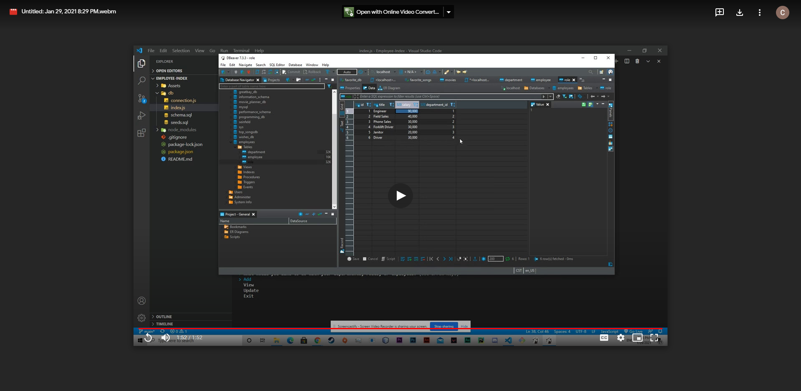

# Employee Index

  ## Description

  Allows you to manage employees, roles, and departments all with one interface.

  ## Installation
  To install necessary dependencies, run the following command(s)
      
    npm i
  
  ## Usage
    
  
  

  ## Questions? 
  If you have any questions feel free to contact me directly at spiegelhaltercurt@gmail.com. 

  If you want to see more of my work visit here: [CSpiegelhalter](https://github.com/CSpiegelhalter)

